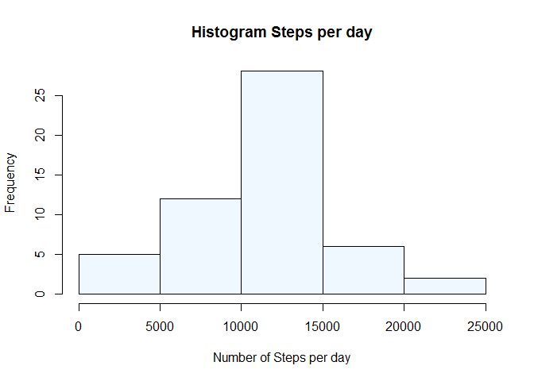
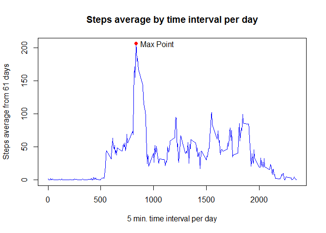
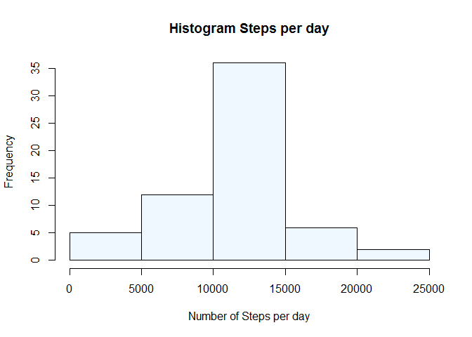
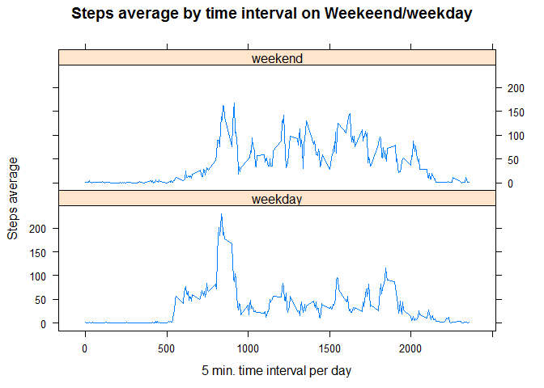

# Data Analysis

## Where the data come from?

It is now possible to collect a large amount of data about personal movement using activity monitoring devices such as a Fitbit, Nike Fuelband, or Jawbone Up. These type of devices are part of the “quantified self” movement – a group of enthusiasts who take measurements about themselves regularly to improve their health, to find patterns in their behavior, or because they are tech geeks. But these data remain under-utilized both because the raw data are hard to obtain and there is a lack of statistical methods and software for processing and interpreting the data.

- Dataset: [Activity monitoring data](./activity.zip) [52K]

## Loading and preprocessing the data

The data will be first unzipped first and then read it into R Studio.

```r
tempDir <- tempdir() #Temporal directory to unzip file
data <- read.csv(unzip("./activity.zip", exdir = tempDir)) #Read file
data$date <- as.Date(data$date)
dataNames <-names(data)
```

The data had only 3 variables:

- **steps**: Number of steps taking in a 5-minute interval (missing values are coded as **NA**)
- **date**: The date on which the measurement was taken in YYYY-MM-DD format
- **interval**: Identifier for the 5-minute interval in which measurement was taken

The imported data looks like this:

```r
head(data)
```

```
##   steps       date interval
## 1    NA 2012-10-01        0
## 2    NA 2012-10-01        5
## 3    NA 2012-10-01       10
## 4    NA 2012-10-01       15
## 5    NA 2012-10-01       20
## 6    NA 2012-10-01       25
```

## What is mean total number of steps taken per day?

The total number of steps for each day is calculate, from this total number steps the mean and median are calculated

```r
totalStepsDay <- aggregate(steps ~ date, data, sum)
meanStepsDay   <- sprintf(mean(totalStepsDay$steps), fmt = "%#.3f") 
medianStepsDay <- median(totalStepsDay$steps)
```

Histogram of the total number of steps for each day

```r
hist(totalStepsDay$steps,     #Histogram
     col = "aliceblue",
     xlab = "Number of Steps per day",
     main = "Histogram Steps per day")
```

<!-- -->

Statistics of Total number of steps for each day:

- Mean: 10766.189
- Median: 10765

## What is the average daily activity pattern?

First the average daily steps activity per interval considering all days need to be calculated.

```r
meanStepsInterval <- aggregate(steps ~ interval, data, mean)
maxPoint <- meanStepsInterval[which.max(meanStepsInterval$steps),] #Maximum Point
```

The next plot shows the calculated results of the average daily steps per interval taking in account all days.

```r
plot(meanStepsInterval$interval, meanStepsInterval$steps,
     type = "l",
     col = "blue",
     xlab = "5 min. time interval per day",
     ylab = "Steps average from 61 days",
     main = "Steps average by time interval per day")
points(maxPoint, pch = 19, col = "red")
text(maxPoint$interval + 200, maxPoint$steps, labels = "Max Point")
```

<!-- -->

It can be seen the Maximum point in the plot, which is:

- Steps:    **206.1698113**
- Interval: **835**

Whit this information it can be said that in average, on the 61 days, in the interval **835** is the time where the most steps are taken in the day.

## Imputing missing values

First the data frame is analyzed to see how many rows had missing values, or in other words are not complete.

```r
rowsInfo <- table(complete.cases(data))
rowsIncomplete <- sprintf((rowsInfo[[1]]/nrow(data))*100, fmt = "%#.2f") #% Incomplete 
rowsComplete <- sprintf((rowsInfo[[2]]/nrow(data))*100, fmt = "%#.2f")   #% Complete 
```

It can be seen that in the data frame there are:

- Incomplete Rows: 2304 (13.11% of the data frame)
- Complete Rows: 15264 (86.89% of the data frame) 

Then the columns are analyzed to see where are **NA** (Missing Values)

```r
colsInfo <- colSums(is.na(data))
```

NA or Missing values in each column:

- steps: 2304 **NA**
- date: 0 **NA**
- interval: 0 **NA**

As it can be seen only the **steps** column is the only one that has **NA** on it, so the imputing of **NA** will be focused on this columns only.

The strategy for filling this **NA** on the steps column will be to take the average of each interval aveaged over all the days, and fill where the **NA** is

```r
dataNew <- data #New data frame without NA
idxNA <- which(is.na(data$steps)) #Index of NA
intervalNA <- dataNew$interval[idxNA] #Vector of Intervals with NA
vectorSteps <- c() #Empty Vector
for (i in 1:length(intervalNA)) {
        newVal <- meanStepsInterval$steps[meanStepsInterval$interval == intervalNA[i]]
        vectorSteps <- append(vectorSteps, newVal) #Vector with Steps
}
dataNew$steps[idxNA]<-vectorSteps #Replace NA with new Vector
```

The new data with the imputating NA looks like this:

```r
head(dataNew)
```

```
##       steps       date interval
## 1 1.7169811 2012-10-01        0
## 2 0.3396226 2012-10-01        5
## 3 0.1320755 2012-10-01       10
## 4 0.1509434 2012-10-01       15
## 5 0.0754717 2012-10-01       20
## 6 2.0943396 2012-10-01       25
```

The total number of steps for each day is calculate, from this total number steps the mean and median are calculated

```r
totalStepsDayNew <- aggregate(steps ~ date, dataNew, sum)
meanStepsDayNew   <- sprintf(mean(totalStepsDayNew$steps), fmt = "%#.3f") 
medianStepsDayNew <- sprintf(median(totalStepsDayNew$steps), fmt = "%#.3f")
```

Histogram of the total number of steps for each day

```r
hist(totalStepsDayNew$steps,     #Histogram
     col = "aliceblue",
     xlab = "Number of Steps per day",
     main = "Histogram Steps per day")
```

<!-- -->

Statistics of Total number of steps for each day:

- Mean: 10766.189
- Median: 10766.189

It can be seen that the values differ from the ones at the beginning of the assignment. Now the mean and the median had the same value. 

## Are there differences in activity patterns between weekdays and weekends?

First it is needed to determine the days where is a **week day** and when is a **weekend day**

```r
days <- weekdays(dataNew$date)
idxWeekend <- which(days %in% c("Saturday", "Sunday"))
days <- replace(days, idxWeekend, "weekend")
days <- replace(days, -idxWeekend, "weekday")
dataNew$day.type <- factor(days)
meanStepsDayType<- aggregate(steps ~ day.type + interval,dataNew, mean)
```

The next plot shows the calculated results of the average daily steps per interval separated by weekday or weekend.

```r
library(lattice)
xyplot(steps~interval|day.type,
       data = meanStepsDayType,
       type = "l",
       layout = c(1,2),
       xlab= "5 min. time interval per day",
       ylab="Steps average",
       main= "Steps average by time interval on Weekeend/weekday")
```

<!-- -->

As it can be seen in the Plot there is a difference between weekdays and weekends on the average number of steps. It can be seen that the average number of steps increase during the weekends, this can be due that the people had free time on the weekends and go out to enjoy their free time, as in comparison with the weekdays where only in certain interval of the days the average number of steps increase.
